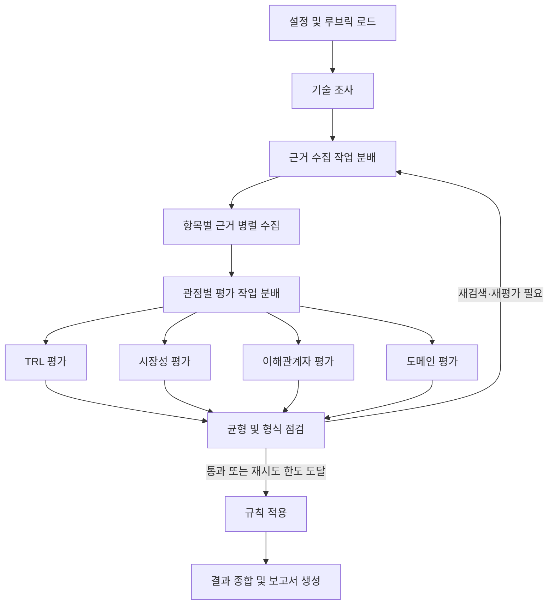

# KV Cache 최적화 기술 다관점 평가 Agentic RAG

본 프로젝트는 KV cache 최적화 기술인 **TurboQuant(SW)** 와 **CXL-PNM(HW)** 을 선정하여,
TRL·시장성·이해관계자·도메인(AI 데이터센터 LLM 추론) 관점에서 근거 기반으로 평가하는
Agentic RAG 프로젝트입니다. 기술의 우열이나 순위를 판정하지 않고, 관점별 평가와 상충 조건,
정보 공백을 정리한 보고서를 자동으로 생성합니다.


## Overview

- **Objective**: 소프트웨어와 하드웨어 기반 KV cache 최적화 기술을 복수 관점에서 비교·평가
- **Method**: Multi-Agent(Distributed) + Agentic RAG
- **Evaluation Perspectives**: TRL, 시장성, 이해관계자, 도메인 적합성
- **Domain**: AI 데이터센터의 장문 LLM 추론 인프라
- **Output**: 근거, 조건, 상충 후보, 정보 공백을 포함한 Markdown·PDF 보고서
- **Principle**: 점수 합산이나 순위화 없이 관점별 결과를 독립적으로 제시

## Selected Technologies

- **SW — TurboQuant**: 온라인 벡터 양자화를 통해 KV cache의 메모리 사용량과 대역폭 병목을 줄일 수 있으며, 기존 GPU 기반 추론 환경에 적용 가능한 소프트웨어 기술이라는 점에서 선정했습니다.
- **HW — CXL-PNM**: CXL 기반 메모리 확장과 Processing-Near-Memory를 결합하여 대용량 KV cache의 저장·전송·연산 병목을 하드웨어 관점에서 개선할 수 있어 비교 대상으로 선정했습니다.

## Features

- 논문 PDF 기반 기술 정보 추출 및 원문 위치 추적
- Tavily 기반 웹 검색과 원문 확인을 통한 최신 근거 수집
- FAISS dense 검색과 BM25 sparse 검색을 RRF로 결합한 하이브리드 검색
- 기술별·평가 항목별 긍정 및 비판 근거의 병렬 수집
- TRL·시장성·이해관계자·도메인 관점별 독립 평가
- 근거 등급, 중복, 관련성 및 측정 유형 분류
- 근거 부족, 편향, 조건 누락, 형식 오류에 대한 자동 점검 및 제한적 재검색·재평가
- 점수 상한·하한, TRL 게이트, 상충 후보를 코드 기반 규칙으로 적용
- 관점별 결과, 트레이드오프, 정보 공백을 포함한 Markdown·PDF 보고서 생성
- **확증 편향 방지 전략**: 두 기술에 동일한 검색 규칙을 적용하고, 긍정·비판 근거를 함께 수집하며, 검색 요약이 아닌 원문을 확인합니다. 또한 LLM의 판단과 규칙 기반 검증을 분리하고, 근거가 부족한 항목은 추정하지 않고 정보 공백으로 기록합니다.

## Tech Stack

- **Language**: Python 3.11–3.12
- **Framework**: LangGraph, LangChain
- **LLM / Generator**: GPT-5.5
- **LLM / Judge**: GPT-5.5
- **Retrieval**: FAISS + BM25, Reciprocal Rank Fusion(RRF), Top-K 5
- **Retrieval Evaluation**: Hit@1·3·5, MRR *(모델 선정 실험 결과 입력 전)*
- **Embedding**: BAAI/bge-m3
- **Web Search**: Tavily
- **Validation**: Pydantic
- **Report**: Markdown, ReportLab PDF
- **Package Manager**: uv
- **Test / Lint**: pytest, Ruff

## Agents

- **Tech Research Agent**: 논문 RAG를 활용해 기술 개요, 작동 원리, 실험 조건 및 한계를 조사
- **Evidence Collection Agent**: 평가 항목별 긍정·비판 근거를 검색하고 원문을 확인해 구조화
- **TRL Agent**: 실험 환경, 구현 수준, 재현성 및 도입 준비도를 평가
- **Market Agent**: 시장 규모, 성장성, 상용화 및 채택 사례를 평가
- **Stakeholder Agent**: 공급자, 도입 기업, 운영자 등 이해관계자별 영향과 요구사항을 평가
- **Domain Agent**: 비용, 에너지, 처리량, 지연시간, 품질 및 통합 난이도를 평가
- **Synthesis Agent**: 관점별 결과와 상충 후보를 종합하고 최종 보고서를 생성

## Architecture



상세 그래프는 [`docs/main_graph.png`](docs/main_graph.png)와
[`docs/architecture.md`](docs/architecture.md)에서 확인할 수 있습니다.

## Directory Structure

```text
├── configs/                 # 기술·도메인 설정, 실행 설정, 평가 루브릭
├── data/                    # 코퍼스 목록, 원문, 청크 및 검색 인덱스
├── deliverables/            # 설계서와 최종 제출물
├── docs/                    # 아키텍처 문서와 그래프 이미지
├── eval/retrieval/          # 임베딩 모델 선정 및 Hit@K·MRR 평가
├── outputs/runs/            # 실행별 평가 결과와 보고서
├── prompts/                 # 기술 조사·근거 추출·채점·종합 프롬프트
├── scripts/                 # 코퍼스 다운로드 스크립트
├── src/kv_eval/
│   ├── agents/              # 기술 조사·관점별 평가·종합 Agent
│   ├── evidence/            # 근거 수집·등급화·중복 처리
│   ├── graph/               # LangGraph 상태·계약·분배·메인 그래프
│   ├── rag/                 # 문서 로딩·청킹·임베딩·검색
│   ├── reporting/           # Markdown·PDF 보고서 생성
│   ├── rules/               # 균형 점검·점수 제한·TRL 게이트·상충 탐지
│   └── tools/               # 논문 검색·웹 검색·원문 확인 도구
├── tests/                   # 단위 및 통합 테스트
├── app.py                   # 실행 스크립트
├── pyproject.toml           # 프로젝트 및 의존성 설정
└── README.md
```

## Usage

### 1. 프로젝트 설치

```bash
git clone https://github.com/seunghye3760-afk/skala-rag-design-course.git
cd skala-rag-design-course
uv sync
```

### 2. 환경 변수 설정

```bash
cp .env.example .env
```

Windows에서는 다음 명령을 사용합니다.

```powershell
copy .env.example .env
```

생성된 `.env` 파일에 `OPENAI_API_KEY`와 `TAVILY_API_KEY`를 입력합니다.

### 3. 테스트 실행

```bash
uv run pytest
```

### 4. 보고서 생성

전체 18개 평가 항목을 실행합니다.

```bash
uv run python app.py
```

일부 평가 항목만 실행할 수도 있습니다.

```bash
uv run python app.py --criteria TRL-1,MKT-2,DOM-4
```

실행 결과는 `outputs/runs/<run_id>/`에 저장됩니다.

> 현재 저장소는 FAKE 데이터를 사용해 전체 그래프의 실행 흐름을 검증할 수 있습니다.
> 각 담당 영역의 실제 구현과 임베딩 선정 실험 결과는 순차적으로 반영합니다.

## Contributors

1. **안서현**: Embedding 모델 선정, 설계서 작성, 코드 점검 및 통합
2. **이민기**: RAG 적용 대상 설계, AI 루브릭 설계, 근거 수집 및 기술 평가
3. **박재흥**: RAG 적용 대상 설계, 시장성 및 이해관계자 평가
4. **김승혜**: 기술 선정 방식 설계, 선정 사유 정리, 관점별 웹 가드레일 설계, 문서·임베딩·검색 및 그래프 통합
