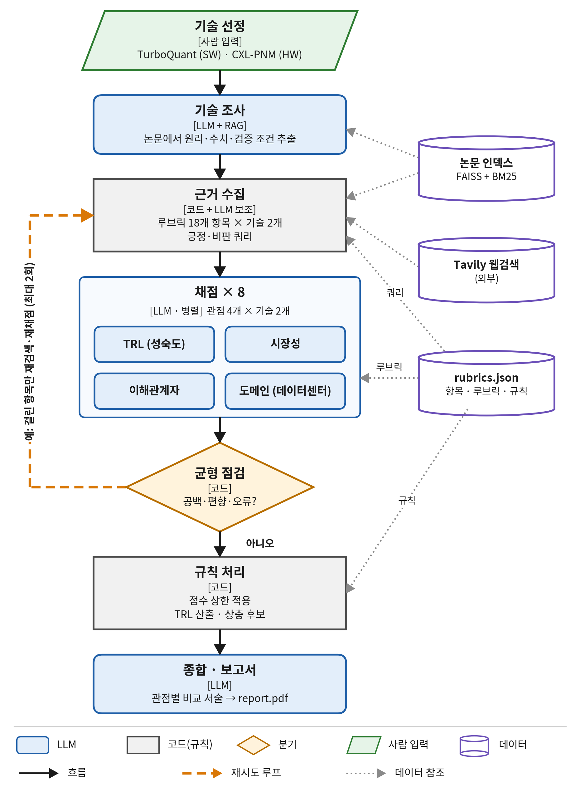

# KV cache 최적화 기술 다관점 평가 Agentic RAG

TurboQuant(SW)와 CXL-PNM(HW)을 **TRL · 시장성 · 이해관계자 · 도메인(AI 데이터센터 LLM 추론)** 관점에서
근거 기반으로 평가하고, 관점 간 상충 후보와 정보 공백을 정리한 보고서를 자동으로 만든다. (우열·순위 판정 없음)



## 빠른 시작
```bash
git clone https://github.com/seunghye3760-afk/skala-rag-design-course.git
cd skala-rag-design-course
uv sync
cp .env.example .env        # Windows: copy .env.example .env  → 키 입력
uv run pytest
uv run python app.py --criteria TRL-1,MKT-2,DOM-4
```
지금은 가짜 데이터(FAKE)로 끝까지 돌고, 각 담당이 `TODO(담당 N)`를 실제 구현으로 바꿔 나간다.

## 구조
| 폴더 | 내용 |
|---|---|
| `configs/` | 기술·도메인, 실행 설정, 루브릭 18개 항목 |
| `data/` | 코퍼스 목록(42쪽), 원문·청크·인덱스 (커밋 안 함) |
| `src/kv_eval/rag` · `tools` | 논문 검색 · 웹 검색 · 원문 확인 |
| `src/kv_eval/evidence` | 긍정·비판 근거 수집, 등급·중복·관련성 |
| `src/kv_eval/agents` | 기술 조사 · 관점별 채점 4종 · 종합 |
| `src/kv_eval/graph` | State · 계약 · 병렬 분배 · 메인 그래프 |
| `src/kv_eval/rules` | 균형 점검 · 점수 상한 · TRL 게이트 · 상충 후보 |
| `src/kv_eval/reporting` | 보고서 (SUMMARY 맨 앞, REFERENCE 맨 끝) |
| `eval/retrieval` | 임베딩 선정 실험 (Hit@5 · MRR) |
| `deliverables/` | 제출용 설계 PDF · 최종 보고서 |

## Contributors
| 이름 | 담당 |
|---|---|
| | 문서·임베딩·검색 |
| | 근거 수집·TRL·도메인 평가 |
| | 시장·이해관계자 평가 |
| | 그래프 통합·보고서 |
