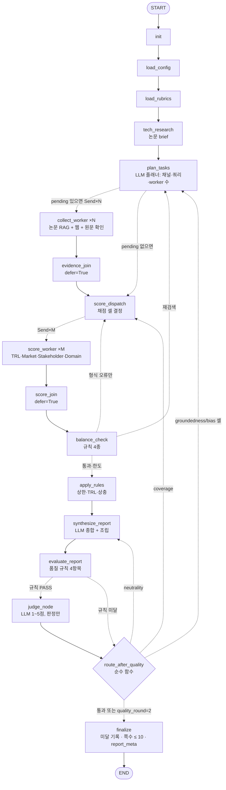

# Subject

본 프로젝트는 KV cache 최적화 기술을 소프트웨어(**TurboQuant**)와 하드웨어(**CXL-PNM**) 두 진영에서 선정하여,
TRL·시장성·이해관계자·도메인(AI 데이터센터 LLM 추론) 4관점에서 근거 기반으로 평가하는
**Orchestrator-Workers 패턴 기반 LangGraph 프로젝트**입니다.
기술의 우열·순위·총점을 판정하지 않고, 관점별 평가와 상충 조건, 정보 공백을 정리한 보고서(PDF ≤ 10쪽)를 생성합니다.

- 실행 스크립트: `app_agent.py` (Orchestrator-Workers) · `app.py`는 이전 RAG 실습 그래프로 그대로 둠
- 조정 계층: `src/kv_eval/orchestrator/` · worker·규칙·보고서 모듈은 RAG 실습 코드를 재사용
- 테스트: `uv run pytest` (95개, `KV_FAKE=1` 가짜 모드로 키 없이 전체 그래프 검증)

---

## Overview

- **Objective** : 하나의 기술을 복수 관점에서 비교 평가 (우열 판정 없음). 데이터센터 운영자가 "어느 시나리오에 어떤 조건으로 검토할지"를 판단할 수 있는 보고서 1부.
- **Pattern** : **Orchestrator-Workers** (택일). 이전 RAG 실습 그래프가 이미 "작업 분배 → 병렬 worker → reducer 누적 → join → 종합" 구조라 필수 항목까지의 거리가 가장 짧았고, Supervisor로 가면 균형 점검을 LLM 라우터로 바꾸고 관점 에이전트 4개를 각각 노드로 쪼개야 해서 변경 폭이 컸습니다. 조정 계층(orchestrator)과 하위 에이전트(agents/evidence)를 물리적으로 분리했습니다.
- **동적 처리** : 고정 순서와 다른 점 세 가지.
  1. **계획이 먼저, worker 수는 그 다음** — `plan_tasks`의 **LLM 플래너**가 항목마다 기술별 검색 채널(논문 RAG / 웹 / 저장소)과 검색 쿼리 템플릿 쌍 수(1~3)를 정하고, **쌍 하나가 수집 worker 하나**가 됩니다. 따라서 fan-out 수 = Σ(셀 × 템플릿 수)이며 실행마다 달라집니다. 예전 그래프는 항상 36개 고정이었습니다.
  2. **되돌아가는 셀만 다시** — 균형 점검(`balance_check`)이 잡은 셀, 품질 평가가 미달로 돌려보낸 셀만 플래너가 재계획합니다. 이때 플래너는 사유("비판 근거 없음", "단일 출처" …)를 읽고 쿼리를 다시 씁니다.
  3. **종료는 상태 조건** — "pending 서브태스크 0개", "retry_targets 비어 있음", "품질 통과"로 끝나며, `retry.max_rounds=2 · quality.max_rounds=2 · recursion_limit=150`은 안전장치입니다.

  실제 실행(2026-10-07, `--criteria TRL-1,DOM-4`, gpt-5.4-mini)의 라운드별 수집 fan-out: **8 → 1 → 1 → 4**
  (초기 LLM 계획 8 / 균형 점검 재검색 1 / 재검색 1 / 품질 미달 재계획 4). 가짜 모드 전체 실행: 셀 36 → worker 54.
  전체 18항목 실제 실행의 fan-out·재작업 횟수: {실측값 기입 — LangSmith 트레이스 tracing-2.png}

---

## Selected Technologies

- **SW — TurboQuant** : 온라인 벡터 양자화로 KV cache의 메모리 사용량과 대역폭 병목을 줄이며, 기존 GPU 추론 환경에 소프트웨어만으로 적용 가능하다는 점에서 선정했습니다.
- **HW — CXL-PNM** : CXL 메모리 확장과 Processing-Near-Memory를 결합해 대용량 KV cache의 저장·전송·연산 병목을 하드웨어 관점에서 개선하는 접근으로, SW 접근과 대조되는 비교 대상으로 선정했습니다.

---

## Features

- 논문 PDF 기반 기술 정보 추출(tech_briefs)과 원문 위치(doc_id·page·chunk) 추적
- Tavily 웹 검색 + 원문 fetch·확인을 통한 최신 근거 수집 (2025-01 이후 자료 우선, 두 기술 동일 규칙)
- FAISS dense + BM25 sparse → RRF 하이브리드 검색 (Top-K 5)
- **LLM 플래너 기반 동적 근거 수집 계획** (채널·쿼리·worker 수), 코드 가드(커버리지·대칭·상한)
- 근거 등급(A~D)·중복·관련성·측정 유형 분류, 원문 확인 게이트를 통한 재분류
- TRL·시장성·이해관계자·도메인 4관점 독립 채점 (구조화 출력, 근거 ID 인용 강제)
- 균형 점검 4종(근거 공백·편향·조건 누락·형식 오류) → 대상 셀만 재검색·재채점 (코드 규칙)
- 점수 상한·하한, TRL 게이트, 상충 후보 추출 (코드 규칙, LLM 판정 아님)
- **보고서 품질 평가** : Groundedness·중립성·편향 통제·관점 커버리지 — 규칙(결정적) → LLM Judge Hybrid, 미달 시 항목별 Loop(최대 2회), 미달 사유를 Generator 프롬프트에 주입
- 보고서(SUMMARY … REFERENCE) Markdown·PDF, 10쪽 초과 시 부록 자동 분리
- 결정 로그(`decision_log.jsonl`)·LangSmith 트레이스·`report_meta.json`으로 실행 전 과정 추적
- **확증 편향 방지 전략** : ① 두 기술에 같은 검색 템플릿·같은 max_results·같은 기간(설계서 C-5 대칭, 코드 가드가 `{tech}` 자리 강제) ② 항목마다 긍정(pro)·비판(con) 쿼리를 반드시 둘 다 실행 ③ 검색 요약이 아니라 원문을 열어 확인한 문장만 Evidence로 ④ LLM 판단(계획·채점·종합·Judge)과 규칙 검증(균형 점검·상한·TRL·품질 규칙)을 다른 함수로 분리 ⑤ 근거가 부족하면 추정하지 않고 `info_gaps`에 기록 ⑥ 균형 점검이 "한쪽 근거만", "단일 출처", "최고 등급 D뿐"을 코드로 잡아 재검색 ⑦ 품질 평가에서 기술별 출처 다양성·pro/con 비율을 다시 확인

---

## Tech Stack

- **Framework** : LangGraph (StateGraph · Send · reducer · defer join · MemorySaver), LangChain
- **LLM / Generator** : GPT-5.5 (`configs/runtime.yaml llm.model`; 개발 중에는 `.env KV_LLM_MODEL`로 gpt-5.4-mini 사용)
- **LLM / Judge** : GPT-5.5 (Generator와 같은 `llm.chat_model()`, `with_structured_output`, temperature 미지정)
- **Retrieval** : FAISS + BM25 (RRF, Top-K 5) — Hit Rate@5 {실측값 기입}, MRR {실측값 기입} (`eval/retrieval/run_selection.py`)
- **Embedding** : BAAI/bge-m3 (오픈소스)
- **Web Search** : Tavily (max_results 5, period_from 2025-01-01)
- **Validation / Report** : Pydantic v2 · ReportLab PDF · pypdf(쪽수 검사)
- **Observability** : LangSmith (`LANGSMITH_TRACING=true`, run_name = run_id), `outputs/runs/<run_id>/decision_log.jsonl`
- **Tooling** : uv, pytest, Ruff

---

## Agents

| 역할 | 노드 / 파일 | 종류 | 읽는 것 | 쓰는 것 |
|---|---|---|---|---|
| **Orchestrator** (지휘자) | `plan_tasks` — `orchestrator/plan.py`, `prompts/plan.md` | LLM + 코드 가드 | tech_briefs, 루브릭, retry_targets 사유, 품질 피드백 | `task_plan`(SubTask 목록), `collect_round`, `node_status` |
| Tech Research Agent | `tech_research` — `agents/tech_research.py` | LLM + 논문 RAG | 논문 인덱스 | `tech_briefs` |
| Evidence Collection Worker ×N | `collect_worker` — `orchestrator/dispatch.py` → `evidence/collect.py` | worker (RAG + 웹 + 원문 확인) | `CollectJob` 하나 | `evidence_pool`, `search_log`, `task_plan`(자기 1건), `errors` |
| TRL · Market · Stakeholder · Domain Agent ×M | `score_worker` — `orchestrator/dispatch.py` → `agents/score_task.py` → `agents/{trl,market,stakeholder,domain}.py` | worker (LLM, 구조화 출력) | `ScoreJob` 하나 (관점·기술·근거) | `criterion_results` |
| Balance / Rules | `balance_check`, `apply_rules` — `rules/` | 코드 | evidence_pool, criterion_results | `retry_targets`, `info_gaps`, `final_results`, `trl_results`, `conflicts` |
| Synthesis Agent | `synthesize_report` — `agents/synthesis.py`, `reporting/report.py` | LLM + 조립 | final_results, conflicts, 실험 조건, 품질 피드백 | `final_assessment`, `report_path` |
| Quality Evaluator | `evaluate_report`(규칙) → `judge_node`(LLM) — `orchestrator/quality.py`, `prompts/quality_judge.md` | 코드 → LLM | report.md, evidence_pool, final_results | `quality_verdict`, `quality_round` |
| Gate (라우팅) | `route_after_plan`, `route_after_balance`, `route_after_quality` | 순수 함수 | task_plan / retry_targets / quality_verdict | (없음 — 다음 노드 이름만) |

- worker는 Send로 받은 Job 하나만 읽고 자기 키만 반환합니다. **하위 에이전트 간 직접 통신은 없습니다** (State Ownership).
- 네 관점 에이전트는 같은 노드(`score_worker`)를 `agent_type`만 바꿔 호출합니다. 프롬프트는 `prompts/score/*.md`.
- **모델이 런타임에 결정하는 지점은 세 곳** — 플래너(계획), 종합(상충 해석·실험 조건 비교 판정), Judge(품질 점수). 그 외 라우팅·종료는 전부 코드입니다 (Deterministic Boundary).

### Fallback (worker 실패 정책, `configs/runtime.yaml fallback`)

| 실패 지점 | 정책 | 기록 |
|---|---|---|
| `collect_worker` 예외 | 같은 입력으로 1회 재시도 → 실패 시 그 셀만 **제외**(`status=excluded`), 나머지 브랜치 계속 | `node_status`, `errors[]`, `last_error`, `info_gaps` |
| `score_worker` 예외 | 1회 재시도 → 해당 항목 **NA** | `node_status=failed`, `errors[]` |
| 플래너 LLM 실패 | 1회 재시도 → 루브릭 기본 템플릿으로 비상 계획 | `decision_log: plan_fallback_default` |
| 품질 평가 한도 도달 | 미달 항목을 SUMMARY 끝에 기록하고 **정상 종료** (`status=PARTIAL`) | `report_meta.json` |

---

## State Schema

`src/kv_eval/orchestrator/state.py`의 `OrchestratorState`. 계약 파일(`graph/state.py`, `graph/task_schema.py`)은 수정하지 않고 import만 합니다. 필드마다 아래 7항목 중 어디에 해당하는지 주석 태그로 적어 두었습니다.

- **제어 vs 페이로드 분리** : 제어 메타(`run_id, task_plan, collect_round, score_cells, retry_round, retry_targets, quality_round, quality_verdict, step_count, status, node_status, errors, last_error, fanout_log`)와 페이로드(`technologies, rubrics, tech_briefs, evidence_pool, search_log, criterion_results, final_results, trl_results, conflicts, final_assessment, report_path`)를 한 TypedDict 안에서 블록으로 나눴습니다. 라우팅 함수는 제어 메타만 읽습니다. (`state.py`)
- **관측성 위치** : State에는 사유의 **요약**만 둡니다(`SubTask.reason`, `RetryTarget.reason`, `QualityVerdict.feedback`). 결정 로그 본문({ts, run_id, node, decision, reason, …})은 `outputs/runs/<run_id>/decision_log.jsonl`, 프롬프트·토큰은 LangSmith 트레이스로 뺐습니다. (`observability.py`)
- **지속성 비용** : `evidence_pool`은 채점에 필요하므로 raw로 누적(압축 금지)하되 round 상한과 `duplicate_group` 중복 제거로 크기를 묶습니다. 원문 전문·검색 캐시는 `.cache/`, 보고서 본문은 파일이고 State에는 `report_path`만 있습니다. 안 쓰는 `messages` 키는 두지 않았습니다. (`evidence/collect.py`, `reporting/`)
- **상관** : `run_id` 하나가 LangSmith `run_name`·`metadata.run_id`, `decision_log.jsonl`, `outputs/runs/<run_id>/`, 체크포인터 `thread_id`의 공통 키입니다. (`observability.run_config()`)
- **재개/복구** : `MemorySaver(thread_id=run_id)` (SQLite는 `--checkpointer sqlite`, 선택 의존성). `node_status[task_id]`가 pending/done/failed/excluded로 실패 지점을 가리키고, `last_error`·`errors[]`에 유형·메시지·시각이 남습니다. (`graph.py`, `dispatch.py`)
- **동시 처리** : 병렬 worker가 쓰는 키는 전부 reducer — `evidence_pool/search_log/criterion_results/errors/fanout_log`는 `operator.add`, `node_status`는 `merge_dict`, `task_plan`은 `merge_tasks`(task_id 기준 최신), `last_error`는 `keep_last`. join 노드는 `defer=True`로 모든 브랜치 뒤 1회. 같은 셀에 worker가 여럿이면 evidence_id에 슬롯 글자를 붙여 충돌을 막습니다. (`state.py`, `dispatch.py`, `tests/test_orchestrator_state.py`)
- **종료 보장** : `retry.max_rounds=2`, `quality.max_rounds=2`, `plan.max_subtasks_per_cell=3`, `limits.recursion_limit=150` — 전부 `configs/runtime.yaml` 상수. 한도 도달 시 미달·공백을 보고서에 적고 정상 종료합니다. 무한 루프 없음은 `tests/test_quality.py`(항상 미달 → 2회 후 finalize)로 확인합니다.

---

## Architecture


```mermaid
flowchart TD
    S([START]) --> I[init] --> C[load_config] --> R[load_rubrics] --> T[tech_research<br/>논문 brief]
    T --> P[plan_tasks<br/>LLM 플래너: 채널·쿼리·worker 수]
    P -. pending 있으면 Send×N .-> W[collect_worker ×N<br/>논문 RAG + 웹 + 원문 확인]
    P -. pending 없으면 .-> SD
    W --> J[evidence_join<br/>defer=True]
    J --> SD[score_dispatch<br/>채점 셀 결정]
    SD -. Send×M .-> SW[score_worker ×M<br/>TRL·Market·Stakeholder·Domain]
    SW --> SJ[score_join<br/>defer=True] --> B[balance_check<br/>규칙 4종]
    B -. 재검색 .-> P
    B -. 형식 오류만 .-> SD
    B -. 통과·한도 .-> A[apply_rules<br/>상한·TRL·상충]
    A --> Y[synthesize_report<br/>LLM 종합 + 조립]
    Y --> E[evaluate_report<br/>품질 규칙 4항목]
    E -. 규칙 PASS .-> JD[judge_node<br/>LLM 1~5점, 판정만]
    E -. 규칙 미달 .-> G{route_after_quality<br/>순수 함수}
    JD --> G
    G -. groundedness/bias 셀 .-> P
    G -. coverage .-> SD
    G -. neutrality .-> Y
    G -. 통과 또는 quality_round=2 .-> F[finalize<br/>미달 기록 · 쪽수 ≤ 10 · report_meta]
    F --> X([END])
```

그래프 정의에서 생성한 원본: [`docs/main_graph_orchestrator.mmd`](docs/main_graph_orchestrator.mmd) (`uv run python scripts/draw_orchestrator_graph.py`).
설계 근거 전문은 [`docs/architecture.md`](docs/architecture.md)의 Orchestrator 절과 [`docs/agent_assignment/`](docs/agent_assignment/)를 참고하세요.

### 보고서 품질 평가 노드 (상세)

| 항목 | 규칙 검사 (`evaluate_report`, 결정적) | LLM Judge (`judge_node`, `prompts/quality_judge.md`) | 미달 시 |
|---|---|---|---|
| Groundedness | 본문 인용 evidence_id가 모두 `evidence_pool`과 REFERENCE에 있는가, 종합 서술의 수치가 인용 근거 claim/excerpt/conditions에 있는가 (`rules/balance.py`의 수치 대조 재사용) | 주장 문장이 인용 출처로 추적되는가 (1~5) | 미달 셀 → `plan_tasks` 재수집 / 셀 특정 불가 → `synthesize_report` 재생성 |
| 중립성 | 금지 표현 사전(`configs/quality.yaml`: 더 우수·우월·추천·순위·1위·승자·총점 …) 0건, `final_assessment`에 합산 키 없음 | 우열·추천 뉘앙스 | `synthesize_report` 재생성 (피드백 주입) |
| 편향 통제 | 기술별 인용 출처 ≥ 2, pro·con 양쪽 근거 항목 비율 ≥ 0.5, 단일 출처 항목 비율 ≤ 0.5 | 유리한 근거 편중·단일 출처 의존 | 미달 셀 → `plan_tasks` 재수집 |
| 관점 커버리지 | 실행 범위의 기술 × 관점마다 NA 아닌 결과 ≥ 1, 보고서에 4관점 절 존재 | 4관점이 실질적으로 서술됐는가 | → `score_dispatch` 재채점 |

규칙 4항목이 전부 PASS일 때만 Judge를 부르고, Judge 4항목이 모두 임계(4/5) 이상이면 통과입니다. Judge는 점수와 코멘트만 내고, 다음 노드는 `route_after_quality`(순수 함수)가 `quality_verdict`만 읽어 정합니다. 미달 사유는 `synthesis_feedback`으로 종합 프롬프트 끝에 붙습니다(Evaluator-Optimizer). 테스트: `tests/test_quality.py` (통과 / 금지 표현 주입 → 재생성 후 통과 / 항상 미달 → 2회 후 정상 종료).

---

## Directory Structure

```text
├── app_agent.py               # Orchestrator-Workers 실행 스크립트 (제출용) — --criteria, --thread, --checkpointer
├── app.py                     # 이전 RAG 실습 그래프 실행 (그대로 유지)
├── configs/
│   ├── runtime.yaml           # llm · retrieval · retry · fallback · concurrency · plan · quality · limits (종료 상한 상수)
│   ├── quality.yaml           # 품질 규칙: 금지 표현 사전, 편향 임계
│   ├── rubrics.json           # 평가 항목 18개 · 관점 4 · 검색 규칙 · TRL 매핑 · 비교 쌍
│   └── technologies.yaml      # 기술 2건 · 도메인 · 시나리오
├── prompts/
│   ├── plan.md                # 플래너 (채널·쿼리 템플릿·worker 수)
│   ├── quality_judge.md       # LLM Judge (4항목 1~5점)
│   ├── synthesis.md           # 종합 (상충 해석 · 실험 조건 비교 판정 · 문장 규칙)
│   ├── tech_research.md · evidence/ · score/{trl,market,stakeholder,domain}.md
├── src/kv_eval/
│   ├── orchestrator/          # ★ 조정 계층 (Agent 과제 신규)
│   │   ├── state.py           #   OrchestratorState(Layered) · SubTask · QualityVerdict · reducer 4종
│   │   ├── plan.py            #   plan_tasks — LLM 플래너 + 가드 + 비상 기본 계획
│   │   ├── dispatch.py        #   Send fan-out · collect/score worker 래퍼(fallback) · defer join
│   │   ├── quality.py         #   evaluate_report(규칙) · judge_node(LLM) · route_after_quality · finalize
│   │   ├── observability.py   #   decision_log.jsonl · LangSmith run_config
│   │   └── graph.py           #   build_orchestrator_graph() — MemorySaver · recursion_limit
│   ├── agents/                # 하위 에이전트: tech_research · score_task(trl/market/stakeholder/domain) · synthesis
│   ├── evidence/              # 근거 수집 worker 본체(collect.py) · 등급(grading.py)
│   ├── rules/                 # 균형 점검(balance) · 상한(caps) · TRL 게이트(trl_gate) · 상충(conflicts) · apply
│   ├── reporting/             # 보고서 조립(report.py) · PDF(pdf.py)
│   ├── rag/                   # 로더 · 청킹 · 임베딩 · FAISS+BM25 검색
│   ├── tools/                 # 논문 검색 · Tavily 웹 검색 · 원문 fetch
│   ├── graph/                 # 계약(task_schema · state · reducers) + 이전 RAG 실습 그래프(main · dispatch)
│   ├── config.py · llm.py · progress.py
├── tests/                     # 95개 — test_plan · test_quality · test_orchestrator_state · test_orchestrator_runs + 기존
├── eval/retrieval/            # 임베딩 모델 선정 (Hit@K · MRR)
├── docs/                      # architecture.md · main_graph_orchestrator.mmd · agent_assignment/ (과제 설계 문서 3종)
├── scripts/                   # download_corpus.py · draw_orchestrator_graph.py
├── data/ · outputs/runs/      # 코퍼스·인덱스 / 실행 결과 (커밋 제외)
└── README.md
```

---

## Usage

```bash
uv sync                                   # 설치 (Python 3.11~3.12)
cp .env.example .env                      # OPENAI_API_KEY, TAVILY_API_KEY, (선택) LANGSMITH_API_KEY, LANGSMITH_TRACING=true
uv run python scripts/download_corpus.py  # 논문 PDF
uv run python -m kv_eval.rag.index --model BAAI/bge-m3   # 인덱스
uv run pytest                             # 95개 (KV_FAKE=1, 키 불필요)
```

```bash
uv run python app_agent.py --criteria TRL-1,DOM-4   # 작게
uv run python app_agent.py                          # 전체 18항목
# macOS에서 faiss·torch 세그폴트가 나면: OMP_NUM_THREADS=1 uv run python app_agent.py
```

끝나면 run_id, 라운드별 fan-out 수, retry_round, quality_round, 품질 판정, status, PDF 쪽수를 출력하고
`outputs/runs/<run_id>/`에 `report.md`, `report.pdf`, (10쪽 초과 시) `appendix.md`, `decision_log.jsonl`, `report_meta.json`,
`evidence.json`, `scores.json`, `search_log.json`이 생깁니다. `KV_FAKE=1`을 붙이면 LLM·검색 없이 뼈대만 돕니다.

---

## 채점 기준 대응

| 항목 | 증빙 위치 |
|---|---|
| 패턴 적용 정합성 | `orchestrator/plan.py`(구조화 서브태스크 `task_plan`), `dispatch.py`(pending만 Send, worker 래퍼 fallback), `graph.py`(`add_conditional_edges` 3곳), `runtime.yaml fallback` |
| 동적 동작 실증 | 위 Overview "동적 처리"의 라운드별 fan-out, `decision_log.jsonl`, LangSmith `tracing-*.png` |
| State Schema 설계 | 위 State Schema 7항목, `orchestrator/state.py` 필드 주석, `tests/test_orchestrator_state.py` |
| 품질 평가 노드 | `orchestrator/quality.py`, `configs/quality.yaml`, `prompts/quality_judge.md`, `tests/test_quality.py` |
| 코드 구조·모듈 분리 | `orchestrator/`(조정) vs `agents/`·`evidence/`·`rules/`(하위), 위 Directory Structure |
| 실행 결과 재현성 | `uv run python app_agent.py` 1회로 PDF 생성, `report_meta.json`에 fan-out·라운드·쪽수, 무한 루프 없음 테스트 |
| Output — 보고서 | `reporting/report.py`: SUMMARY → 1~9장 → REFERENCE, `finalize`가 10쪽 초과 시 부록 분리 |

---

## Contributors

| 이름 | 이전 RAG 실습 | 이번 Agent 과제 |
|---|---|---|
| 안서현 | Embedding 모델 선정, 설계서 작성, 코드 점검 및 통합 | {역할 기입} |
| 이민기 | RAG 적용 대상 설계, AI 루브릭 설계, 근거 수집 및 기술 평가 설계 | Orchestrator-Workers 조정 계층(`orchestrator/`) 설계·구현, LLM 플래너·동적 fan-out·fallback, 보고서 품질 평가 노드·Loop, State Schema, 보고서 가독성 개선, 테스트·문서 |
| 박재흥 | RAG 적용 대상 설계, 시장성 및 이해관계자 평가 설계, 설계서 현행화 점검 | {역할 기입} |
| 김승혜 | 기술 선정 방식 설계, 관점별 웹 가드레일 설계, 문서·임베딩·검색 및 그래프 통합 | {역할 기입} |
