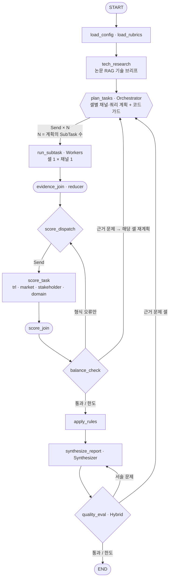

# KV Cache 최적화 기술 다관점 평가 — Orchestrator-Workers

본 프로젝트는 KV cache 최적화 기술을 소프트웨어(**TurboQuant**)와 하드웨어(**CXL-PNM**) 두 진영에서 선정하여,
기술 성숙도·시장성·이해관계자·도메인(AI 데이터센터 LLM 추론) 관점에서 평가하는
**Orchestrator-Workers** 패턴 기반으로 설계·개발한 프로젝트입니다.
기술의 우열이나 순위를 판정하지 않고, 관점별 평가와 상충 조건, 정보 공백을 정리한 보고서를 생성합니다.

> 이 브랜치(`agent/orchestrator-workers`)는 RAG 과제(`main`)의 순차·병렬 흐름을 에이전트 패턴으로 재설계한 Agent 과제 결과물입니다.
> `main` 대비 변경 내역: [`docs/agent-orchestrator-changes.md`](docs/agent-orchestrator-changes.md)

## Overview

- **Objective**: 하나의 기술을 복수 관점에서 근거 기반으로 평가하고, 두 기술을 관점별로 대조
- **Pattern**: Orchestrator-Workers — 평가 단위(기술 × 항목 × 검색 채널)가 서로 독립적이라 병렬 분할이 자연스럽고,
  RAG 과제의 `Send` 병렬 구조·reducer를 Worker 계층으로 재사용할 수 있으며, Supervisor처럼 셀마다 LLM 라우팅을 거치지 않아 재현성과 비용 면에서 유리함
- **동적 처리** (고정 순서와 다른 점):
  - Worker 수를 코드가 아니라 **Orchestrator의 계획이 정함** — 셀마다 필요한 채널(rag / web / open_source)과 추가 쿼리를 LLM이 고르고 코드 가드가 검증 (셀마다 Worker 1~3개)
  - 근거 점검이나 보고서 품질 평가에서 미달한 **셀만 다시 계획**해 작은 fan-out을 한 번 더 실행 (round 0은 전체 셀, round 1부터는 미달 셀만)
  - 보고서 품질 평가 결과에 따라 **재계획 / 재작성 / 종료**를 State 기반으로 분기 (`add_conditional_edges`)

## Selected Technologies

- **SW — TurboQuant**: 온라인 벡터 양자화로 KV cache의 메모리 사용량과 대역폭 병목을 줄이며, 기존 GPU 추론 환경에 바로 적용 가능한 소프트웨어 기술
- **HW — CXL-PNM**: CXL 기반 메모리 확장과 Processing-Near-Memory를 결합해 대용량 KV cache의 저장·전송·연산 병목을 하드웨어 측면에서 개선하는 기술

## Features

- 논문 PDF 기반 기술 정보 추출과 원문 위치(page·section·chunk) 추적
- FAISS(dense) + BM25(sparse)를 RRF로 결합한 하이브리드 검색, Tavily 웹 검색과 원문 확인
- **Orchestrator 계획 + 코드 가드**: 커버리지(모든 셀 최소 1개), 루브릭 허용 채널만, 대상 셀만, 라운드당 Worker 상한
- **Worker fallback**: 예외 시 재시도 → 소진되면 해당 Worker만 제외하고 계속 (근거 공백은 다음 라운드 재계획으로 보완)
- TRL·시장성·이해관계자·도메인 관점별 독립 채점, 점수 상한·하한·TRL 게이트·상충 후보는 코드 규칙으로 적용
- **확증 편향 방지 전략**
  - 모든 쿼리를 긍정(pro)·비판(con) 한 쌍으로 강제 (계획 스키마 `QueryPair`)
  - 두 기술에 같은 쿼리 템플릿·검색 기간·결과 수 적용, 독립 출처가 필요한 셀은 채널을 2개 이상 계획
  - 검색 요약이 아니라 원문을 확인해 근거를 만들고, 근거 등급(A~D)은 LLM이 아닌 코드가 판정
  - 근거가 부족하면 추정하지 않고 정보 공백(NA)으로 기록
- **보고서 품질 평가 (Hybrid)**: 보고서 생성 후 Groundedness·중립성·편향 통제·관점 커버리지를 규칙 검사 + LLM Judge로 판정,
  미달 시 근거 문제 셀은 재계획, 서술 문제는 지적 사항을 넣어 재작성 (최대 2회)
- 체크포인트 기반 중단 재개(`--resume`), 결정 로그(`decisions.jsonl`)와 LangSmith 트레이스를 `trace_id`로 연결

## Tech Stack

- **Framework**: LangGraph, LangChain
- **LLM / Generator**: GPT-5.5 (`configs/runtime.yaml` llm.model)
- **LLM / Judge**: GPT-5.5 (같은 설정 사용, 인용 문장 검증으로 비결정성 통제)
- **Retrieval**: FAISS + BM25, Reciprocal Rank Fusion, Top-K 5 — Hit@K·MRR *(선정 실험 결과 입력 전: `eval/retrieval/model_selection.md`)*
- **Embedding**: BAAI/bge-m3
- **Web Search**: Tavily
- **Checkpoint / Tracing**: langgraph-checkpoint-sqlite, LangSmith
- **Validation / Report**: Pydantic, Markdown + ReportLab PDF
- **Package / Test**: uv, pytest, Ruff

## Agents

| 계층 | 노드 | 역할 |
|---|---|---|
| **Orchestrator** | `plan_tasks` | 계획할 셀을 정하고(최초: 전체 / 재계획: 미달 셀만) 셀별 채널·추가 쿼리·우선순위·사유를 LLM으로 계획 → 코드 가드 검증 → `State.plan` 저장 |
| **Workers** | `run_subtask` | SubTask 1개 = 셀 1개 × 채널 1개의 근거 수집. 서로 통신하지 않고 reducer 필드에만 기록 |
| 관점 에이전트 | `score_task` (trl·market·stakeholder·domain) | 수집된 근거만으로 항목별 5점 척도 채점 |
| 점검 | `balance_check` | 근거 공백·편향·조건 누락·형식 오류를 코드로 점검 → 재계획 / 재채점 / 진행 |
| **Synthesizer** | `synthesize_report` | 관점별 결과와 상충 후보를 종합해 보고서(Markdown·PDF) 작성 |
| 품질 평가 | `quality_eval` | Hybrid 품질 판정 → 통과 / 재계획 / 재작성 / 종료 |
| 조사 | `tech_research` | 논문 RAG로 기술 브리프 작성 (계획 노드의 입력) |

## State Schema

정의: [`src/kv_eval/graph/state.py`](src/kv_eval/graph/state.py) — 입력·설정 / 제어 메타데이터 / 작업 페이로드 세 구역으로 나눔

| 항목 | 설계 | 코드 |
|---|---|---|
| 제어 vs 페이로드 분리 | 라우팅·계획·종료·재개에 필요한 값(`plan`, `retry_targets`, `retry_round`, `quality_round`, `eval_result`, `step_count`, `node_status`)과 작업 결과(`evidence_pool`, `criterion_results`, `final_results` 등)를 구역으로 나눔. Worker 결과도 제어 메타(`WorkerOutcome`)와 근거 본문(`evidence_pool`)을 분리 | `graph/state.py`, `orchestrator/schema.py` |
| 관측성 위치 | 결정과 사유는 State 밖으로 — `decisions.jsonl`(계획·재시도·품질 판정·Worker 제외), `plans/r{n}.json`(라운드별 전체 계획), LangSmith 트레이스 | `obs.py` |
| 지속성 비용 | 체크포인트마다 저장되므로 원문 본문·검색 원본은 넣지 않음(excerpt·locator만, 원문은 `.cache/`), 보고서는 경로만, 계획은 현재 라운드만. 누적 필드는 라운드 상한 × Worker 상한(80)으로 크기가 묶임 | `graph/state.py` |
| 상관 | `trace_id` → LangSmith run metadata와 결정 로그에 함께 기록, `run_id` → 체크포인트 `thread_id`·출력 폴더명 | `obs.langgraph_config`, `app.py` |
| 재개/복구 | SQLite 체크포인터로 노드 단위 저장, `app.py --resume <run_id>`로 중단 지점부터 재개(완료된 Worker는 다시 실행하지 않음). `node_status`·`last_error`로 상태와 에러 확인 | `app.py`, `tests/test_state_ops.py` |
| 동시 처리 | 동적 fan-out에서 동시에 쓰는 필드는 모두 reducer: `operator.add`(근거·검색 로그·Worker 결과), `_merge`(node_status), `_last_error`(last_error) | `graph/state.py` |
| 종료 보장 | 루프별 상한 `retry_round`(2)·`quality_round`(2) + 조정 노드 전체 상한 `step_count`(20) + LangGraph `recursion_limit`(200). 상한 도달 시 라우터가 루프 대신 마무리 경로 선택 | `graph/guards.py`, `configs/runtime.yaml` |

## 보고서 품질 평가

보고서 생성 후 `quality_eval` 노드가 4개 축을 판정합니다 (3안 Hybrid). 축 통과 조건은 **규칙 통과 AND judge 통과**입니다.

| 축 | 규칙 검사 (결정적) | LLM Judge |
|---|---|---|
| Groundedness | 점수 있는 항목의 근거 인용, 인용 id 실재, REFERENCE 존재, 종합 서술의 수치가 근거 원문에 있는지 | 주장이 인용 근거로 추적되는가 |
| 중립성 | 우열·추천·순위·합산 표현 금지어 | 추천·우열 암시 여부 |
| 편향 통제 | 기술별 발행 주체 수 ≥3, 단일 주체 비중 ≤50%, 비판 근거 ≥20%, 두 기술 인용 수 비율 ≥0.5 | 한쪽 근거만으로 결론을 냈는가 |
| 관점 커버리지 | 기술마다 4관점 존재·전 항목 NA 아님, SUMMARY·REFERENCE 목차 | 4관점이 서술에 반영됐는가 |

- **Judge 비결정성 통제**: 위반마다 보고서 문장을 그대로 인용하게 하고, 그 문장이 실제로 있는지 코드로 대조해 없으면 버림. 점수 < 3 **이고** 검증된 위반이 있을 때만 축 실패
- **미달 시 Loop**: 셀로 특정되는 근거 문제 → `plan_tasks` 재계획 / 서술 문제만 → `synthesize_report` 재작성(지적 사항 전달) / 상한 도달 → 판정 결과를 `quality_r{n}.json`에 남기고 종료

## Architecture


```mermaid
flowchart TD
    S([START]) --> CFG[load_config · load_rubrics]
    CFG --> RES[tech_research<br/>논문 RAG 기술 브리프]
    RES --> PLAN{{"plan_tasks · Orchestrator<br/>셀별 채널·쿼리 계획 + 코드 가드"}}
    PLAN -->|"Send × N<br/>N = 계획의 SubTask 수"| W["run_subtask · Workers<br/>셀 1 × 채널 1"]
    W --> EJ([evidence_join · reducer])
    EJ --> SD{score_dispatch}
    SD -->|Send| SC["score_task<br/>trl · market · stakeholder · domain"]
    SC --> SJ([score_join])
    SJ --> BAL{balance_check}
    BAL -->|근거 문제 → 해당 셀 재계획| PLAN
    BAL -->|형식 오류만| SD
    BAL -->|통과 / 한도| RULE[apply_rules]
    RULE --> SYN["synthesize_report · Synthesizer"]
    SYN --> QE{"quality_eval · Hybrid"}
    QE -->|근거 문제 셀| PLAN
    QE -->|서술 문제| SYN
    QE -->|통과 / 한도| E([END])
```

`main` 대비 구조도·Orchestrator 내부·Worker 경로·State 저장 시점: [`docs/diagrams.md`](docs/diagrams.md) · 코드에서 자동 생성한 그래프: [`docs/agent_graph.mmd`](docs/agent_graph.mmd) · LangSmith 트레이스: `deliverables/tracing-*.png`

## Directory Structure

```text
├── configs/                 # 기술·도메인 설정, runtime.yaml(orchestrator·quality 상한), 루브릭
├── data/                    # 코퍼스 목록, 원문, 청크·검색 인덱스
├── docs/                    # 아키텍처 그래프, 변경 내역
├── eval/retrieval/          # 임베딩 모델 선정, Hit@K·MRR
├── outputs/runs/<run_id>/   # 보고서·근거·점수·decisions.jsonl·plans/·quality_r*.json
├── prompts/
│   ├── orchestrator/        # 계획 프롬프트
│   ├── quality/             # Judge 프롬프트
│   ├── evidence/ · score/   # 근거 추출·관점별 채점
│   └── synthesis.md · tech_research.md
├── src/kv_eval/
│   ├── orchestrator/        # ★ 조정 계층: 계획 스키마·Orchestrator·Workers
│   ├── quality/             # ★ 보고서 품질 평가 (규칙·Judge·라우팅)
│   ├── graph/               # State·reducer·가드·채점 분배·메인 그래프
│   ├── agents/              # 기술 조사·관점별 채점·종합 에이전트
│   ├── evidence/            # 근거 수집(채널별)·등급화
│   ├── rag/ · tools/        # 검색·웹·원문 확인 도구
│   ├── rules/               # 균형 점검·점수 상한·TRL 게이트·상충 탐지
│   ├── reporting/           # Markdown·PDF 보고서
│   └── obs.py               # 결정 로그·계획 덤프·LangSmith config
├── tests/                   # 단위·그래프 통합 테스트 (KV_FAKE=1로 API 없이 실행)
├── app.py                   # 실행 스크립트
└── README.md
```

## Usage

```bash
uv sync
cp .env.example .env        # OPENAI_API_KEY, TAVILY_API_KEY (+ LangSmith 추적 시 LANGSMITH_*)
uv run python -m kv_eval.rag.index --model BAAI/bge-m3
```

```bash
uv run python app.py                                      # 전체 18개 항목 × 기술 2개
uv run python app.py --criteria TRL-2,MKT-2,STK-2,DOM-4   # 관점별 1개씩 작게
uv run python app.py --resume <run_id>                    # 중단된 실행 재개
uv run pytest                                             # API 없이 그래프·루프·재개 검증
```

LangSmith 추적은 `.env`에 `LANGSMITH_TRACING=true`, `LANGSMITH_API_KEY`, `LANGSMITH_PROJECT`를 넣으면 켜지며,
트레이스 metadata의 `trace_id`로 `outputs/runs/<run_id>/decisions.jsonl`과 대조할 수 있습니다.

## Contributors

> TODO: Agent 과제 기준 개인별 수행 역할로 갱신 (PM·PL 역할 제외). 아래는 RAG 과제 당시 역할.

- **안서현**: Embedding 모델 선정, 설계서 작성, 코드 점검 및 통합, 이슈 확인
- **이민기**: RAG 적용 대상 설계, AI 루브릭 설계, 근거 수집 및 기술 평가 설계
- **박재흥**: RAG 적용 대상 설계, 시장성 및 이해관계자 평가 설계, 설계서 현행화 점검
- **김승혜**: 기술 선정 방식 설계, 관점별 웹 가드레일 설계, 문서·임베딩·검색 및 그래프 통합
