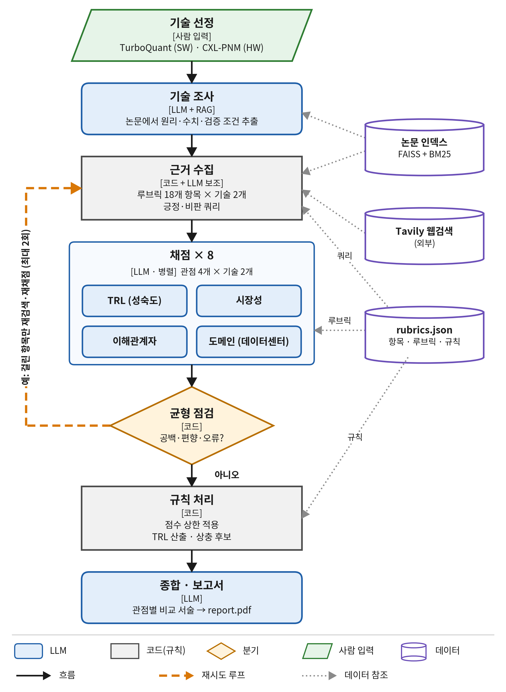
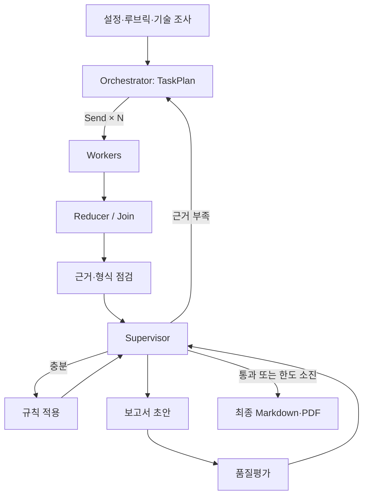

# KV Cache 최적화 기술 다관점 평가 Agentic RAG

본 프로젝트는 KV cache 최적화 기술인 **TurboQuant(SW)** 와 **CXL-PNM(HW)** 을 선정하여,
TRL·시장성·이해관계자·도메인(AI 데이터센터 LLM 추론) 관점에서 근거 기반으로 평가하는
Agentic RAG 프로젝트입니다. 기술의 우열이나 순위를 판정하지 않고, 관점별 평가와 상충 조건,
정보 공백을 정리한 보고서를 자동으로 생성합니다.



## Overview

- **Objective**: 소프트웨어와 하드웨어 기반 KV cache 최적화 기술을 복수 관점에서 비교·평가
- **Method**: Multi-Agent(Distributed) + Agentic RAG
- **Evaluation Perspectives**: TRL, 시장성, 이해관계자, 도메인 적합성
- **Domain**: AI 데이터센터의 장문 LLM 추론 인프라
- **Output**: 근거, 조건, 상충 후보, 정보 공백을 포함한 Markdown·PDF 보고서
- **Principle**: 점수 합산이나 순위화 없이 관점별 결과를 독립적으로 제시

## Selected Technologies

- **SW — TurboQuant**: 온라인 벡터 양자화를 통해 KV cache의 메모리 사용량과 대역폭 병목을 줄일 수 있으며, 기존 GPU 기반 추론 환경에 적용 가능한 소프트웨어 기술이라는 점에서 선정했습니다.
- **HW — CXL-PNM**: CXL 기반 메모리 확장과 Processing-Near-Memory를 결합하여 대용량 KV cache의 저장·전송·연산 병목을 하드웨어 관점에서 개선할 수 있어 비교 대상으로 선정했습니다.

## Features

- 논문 PDF 기반 기술 정보 추출 및 원문 위치 추적
- Tavily 기반 웹 검색과 원문 확인을 통한 최신 근거 수집
- FAISS dense 검색과 BM25 sparse 검색을 RRF로 결합한 하이브리드 검색
- 기술별·평가 항목별 긍정 및 비판 근거의 병렬 수집
- TRL·시장성·이해관계자·도메인 관점별 독립 평가
- 근거 등급, 중복, 관련성 및 측정 유형 분류
- 근거 부족, 편향, 조건 누락, 형식 오류에 대한 자동 점검 및 제한적 재검색·재평가
- 점수 상한·하한, TRL 게이트, 상충 후보를 코드 기반 규칙으로 적용
- 관점별 결과, 트레이드오프, 정보 공백을 포함한 Markdown·PDF 보고서 생성
- **확증 편향 방지 전략**: 두 기술에 동일한 검색 규칙을 적용하고, 긍정·비판 근거를 함께 수집하며, 검색 요약이 아닌 원문을 확인합니다. 또한 LLM의 판단과 규칙 기반 검증을 분리하고, 근거가 부족한 항목은 추정하지 않고 정보 공백으로 기록합니다.

## Tech Stack

- **Language**: Python 3.11–3.12
- **Framework**: LangGraph, LangChain
- **LLM / Generator**: GPT-5.5
- **LLM / Judge**: GPT-5.5
- **Retrieval**: FAISS + BM25, Reciprocal Rank Fusion(RRF), Top-K 5
- **Retrieval Evaluation**: Hit@1·3·5, MRR *(모델 선정 실험 결과 입력 전)*
- **Embedding**: BAAI/bge-m3
- **Web Search**: Tavily
- **Validation**: Pydantic
- **Report**: Markdown, ReportLab PDF
- **Package Manager**: uv
- **Test / Lint**: pytest, Ruff

## Agents

- **Tech Research Agent**: 논문 RAG를 활용해 기술 개요, 작동 원리, 실험 조건 및 한계를 조사
- **Evidence Collection Agent**: 평가 항목별 긍정·비판 근거를 검색하고 원문을 확인해 구조화
- **TRL Agent**: 실험 환경, 구현 수준, 재현성 및 도입 준비도를 평가
- **Market Agent**: 시장 규모, 성장성, 상용화 및 채택 사례를 평가
- **Stakeholder Agent**: 공급자, 도입 기업, 운영자 등 이해관계자별 영향과 요구사항을 평가
- **Domain Agent**: 비용, 에너지, 처리량, 지연시간, 품질 및 통합 난이도를 평가
- **Synthesis Agent**: 관점별 결과와 상충 후보를 종합하고 최종 보고서를 생성
- **Orchestrator**: 현재 루브릭과 재작업 대상을 구조화된 `TaskPlan`으로 만들고 Worker 수를 동적으로 결정
- **Supervisor**: 근거 충분도·현재 단계·보고서 품질에 따라 다음 작업을 조건부 라우팅
- **Report Quality Agent**: Groundedness·중립성·편향 통제·관점 커버리지를 Hybrid 방식으로 평가

## Architecture


```mermaid
flowchart TD
    A[설정·루브릭·기술 조사] --> P[Orchestrator: TaskPlan]
    P -->|Send × N| W[Workers]
    W --> J[Reducer / Join]
    J --> B[근거·형식 점검]
    B --> S[Supervisor]
    S -->|근거 부족| P
    S -->|충분| R[규칙 적용]
    R --> S
    S --> Y[보고서 초안]
    Y --> Q[품질평가]
    Q --> S
    S -->|통과 또는 한도 소진| F[최종 Markdown·PDF]
```

### Pattern and state design

- 제출 주 패턴은 **Orchestrator-Workers**이며 Supervisor는 그 위의 제어 계층입니다.
- Worker는 서로 직접 통신하지 않고 결과를 reducer에 기록한 뒤 Supervisor로 돌아옵니다.
- `TaskPlan`은 State에 저장되며 최초 실행과 재시도 모두 현재 State에서 동적으로 만들어집니다.
- State는 Control, Planning, Domain payload, Report, Observability 레이어로 구분합니다.
- 대용량 원문은 State에 넣지 않고 캐시·산출물 경로로 관리합니다.
- Worker 오류는 `WorkerResult(status="failed")`로 바뀌어 다른 병렬 작업을 중단시키지 않습니다.
- 검색/채점 재시도는 최대 2라운드, 보고서 수정은 최대 2회, Supervisor는 최대 12단계로 종료가 보장됩니다.
- SQLite checkpointer와 `run_id == thread_id`를 사용해 중단된 실행을 재개할 수 있습니다.
- 상세 실행 경로는 LangSmith에서 `run_id`, task ID, 노드 이름으로 추적합니다.

### State Schema 설계 요약

| 항목 | 설계 반영 내용 | 설계 이유 |
|---|---|---|
| **제어 vs 페이로드 분리** | State를 Control, Planning, Domain payload, Report, Observability 레이어로 나누고 라우팅 정보와 조사 결과를 분리했습니다. | Supervisor가 판단에 필요한 최소 제어 상태만 읽도록 하여 작업 결과와 실행 흐름이 서로 얽히지 않게 했습니다. |
| **관측성 위치** | 현재 결정과 요약된 결정 이력은 State에 남기고, 노드별 상세 실행 과정과 판단 사유는 LangSmith trace에 기록합니다. | 재개에 필요한 정보는 보존하면서도 디버깅용 로그가 체크포인트를 과도하게 키우지 않도록 했습니다. |
| **지속성 비용** | 원문 전체와 검색 페이지는 캐시·파일에 저장하고 State에는 구조화된 Evidence, 참조 ID, 결과 경로만 보관합니다. | 체크포인트마다 대용량 원문이 반복 저장되어 State가 무한히 증가하는 문제를 방지했습니다. |
| **상관 관계** | 하나의 실행에서 `run_id`와 `thread_id`를 동일하게 사용하고, 개별 작업에는 고유 task ID를 부여합니다. | State, SQLite checkpoint, LangSmith trace, 실행 산출물을 같은 실행 단위로 연결할 수 있습니다. |
| **재개·복구** | Worker의 성공·실패·시도 횟수를 구조화해 저장하고 SQLite checkpointer로 마지막 완료 노드 이후부터 실행을 재개합니다. | 일부 Worker가 실패하거나 프로세스가 중단되어도 완료된 작업을 처음부터 다시 수행하지 않도록 했습니다. |
| **동시 처리** | Orchestrator가 만든 작업 수만큼 `Send`로 동적 fan-out하고, 병렬 결과는 reducer를 통해 누적·중복 제거·최신화합니다. | 여러 Worker가 동시에 같은 State 채널에 기록해도 결과가 덮어써지거나 유실되지 않도록 했습니다. |
| **종료 보장** | 검색·채점은 최대 2라운드, 보고서 수정은 최대 2회, Supervisor는 최대 12단계로 제한하며 한도 소진 시 `completed_with_gaps`로 종료합니다. | 근거 부족이나 품질 미달이 계속되더라도 무한 루프 없이 남은 한계를 명시한 결과를 생성하도록 했습니다. |

### Report quality loop

보고서 파일은 초안 생성 직후 저장하지 않습니다. 코드 기반 검사와 LLM Judge가 Groundedness,
중립성, 편향 통제, 4개 관점 커버리지를 평가한 뒤 Supervisor가 수정 또는 최종화를 선택합니다.
수정 한도를 소진하면 `completed_with_gaps`로 종료하여 무한 루프를 방지합니다.

### 실제 실행 검증과 제출 전 수정 필요 사항

2026-10-07 전체 18개 항목을 실제 OpenAI·Tavily API로 실행해 동적 작업 계획, 병렬 근거 수집,
관점별 채점, Supervisor 재작업, 보고서 품질평가 및 Markdown·PDF 생성을 확인했습니다.
실행 중 최초 근거 1,343건을 수집했고, 부족 항목만 두 차례 재작업한 뒤 최종 결과 36건을
생성했습니다. 품질 수정 한도까지 사용한 최종 상태는 `completed_with_gaps`입니다.

현재 결과는 파이프라인 검증용이며 아래 항목을 해결한 후 제출본으로 확정해야 합니다.

| 우선순위 | 수정 필요 사항 | 완료 기준 |
|---|---|---|
| P0 | PDF가 92쪽으로 과제 제한인 10쪽을 초과함 | 본문은 핵심 판정과 대표 근거만 남기고 상세 Evidence는 별도 JSON으로 분리해 PDF를 10쪽 이내로 생성 |
| P0 | SUMMARY에는 정보 공백 0건, 상세 결과에는 6건으로 표시되어 서로 불일치함 | 모든 요약 수치가 `info_gaps`와 동일한 State 값을 사용하고 생성 후 일관성 검사 통과 |
| P0 | 최종 품질평가에서 Groundedness와 편향 통제가 미통과함 | 네 품질 차원 모두 통과하거나, 미통과 사유가 보고서 제한 사항에 정확히 반영됨 |
| P1 | 실험 조건 전체 문자열과 중복 REFERENCE가 보고서에 출력되어 가독성이 낮음 | 조건은 모델·문맥 길이·하드웨어·측정 지표로 요약하고 참고문헌은 출처 단위로 중복 제거 |
| P1 | 개발 주체 실측, 독립 실측, 2차 자료의 구분이 SUMMARY에서 충분히 드러나지 않음 | 핵심 수치마다 근거 주체와 검증 수준을 일관된 라벨로 표시 |
| P1 | 비판 근거가 없거나 최고 등급이 D인 항목의 제한이 점수·확신도 설명에 약하게 반영됨 | 해당 항목에 낮은 확신도와 해석 제한 문구가 자동으로 연결됨 |
| P1 | 관점 대조 섹션과 P1~P6 분석이 비어 있을 수 있음 | 생성 가능한 비교는 채우고, 생성 불가 시 사유와 평가 영향을 명시 |
| P2 | SQLite 재개 기능은 있으나 CLI에 재개 옵션이 없음 | `--resume <run_id>`로 기존 체크포인트에서 재개 가능 |
| P2 | `worker_max_attempts`와 `excluded` 상태가 실제 Worker 재시도 정책에 완전히 연결되지 않음 | 설정값에 따라 재시도·제외가 실행되고 `WorkerResult`와 테스트로 확인 가능 |

실행 산출물에는 API 응답과 대용량 체크포인트가 포함될 수 있으므로 Git에는 올리지 않고,
최종 제출용 PDF와 LangSmith 실행 화면만 별도로 검수해 제출합니다.

상세 그래프는 [`docs/main_graph.mmd`](docs/main_graph.mmd)와
[`docs/architecture.md`](docs/architecture.md)에서 확인할 수 있습니다. 기존 PNG는 이전 RAG 설계의 참고본입니다.

## Directory Structure

```text
├── configs/                 # 기술·도메인 설정, 실행 설정, 평가 루브릭
├── data/                    # 코퍼스 목록, 원문, 청크 및 검색 인덱스
├── deliverables/            # 설계서와 최종 제출물
├── docs/                    # 아키텍처 문서와 그래프 이미지
├── eval/retrieval/          # 임베딩 모델 선정 및 Hit@K·MRR 평가
├── outputs/runs/            # 실행별 평가 결과와 보고서
├── prompts/                 # 기술 조사·근거 추출·채점·종합 프롬프트
├── scripts/                 # 코퍼스 다운로드 스크립트
├── src/kv_eval/
│   ├── agents/              # 기술 조사·관점별 평가·종합 Agent
│   ├── evidence/            # 근거 수집·등급화·중복 처리
│   ├── graph/               # LangGraph 상태·계약·분배·메인 그래프
│   ├── rag/                 # 문서 로딩·청킹·임베딩·검색
│   ├── reporting/           # Markdown·PDF 보고서 생성
│   ├── rules/               # 균형 점검·점수 제한·TRL 게이트·상충 탐지
│   └── tools/               # 논문 검색·웹 검색·원문 확인 도구
├── tests/                   # 단위 및 통합 테스트
├── app.py                   # 실행 스크립트
├── pyproject.toml           # 프로젝트 및 의존성 설정
└── README.md
```

## Usage

### 1. 프로젝트 설치

```bash
git clone https://github.com/seunghye3760-afk/skala-rag-design-course.git
cd skala-rag-design-course
uv sync
```

### 2. 환경 변수 설정

```bash
cp .env.example .env
```

Windows에서는 다음 명령을 사용합니다.

```powershell
copy .env.example .env
```

생성된 `.env` 파일에 `OPENAI_API_KEY`와 `TAVILY_API_KEY`를 입력합니다.

### 3. 테스트 실행

```bash
uv run pytest
```

### 4. 임베딩 모델 적용

```
  uv run python -m kv_eval.rag.index --model BAAI/bge-m3
```

### 5. 보고서 생성

전체 18개 평가 항목을 실행합니다.

```bash
uv run python app.py
```

일부 평가 항목만 실행할 수도 있습니다.

```bash
uv run python app.py --criteria TRL-1,MKT-2,DOM-4
```

실행 결과는 `outputs/runs/<run_id>/`에 저장됩니다.
같은 폴더의 `checkpoints.sqlite`에는 재개 가능한 LangGraph 체크포인트가 저장됩니다.

> `KV_FAKE=1`은 API 없이 전체 그래프 구조만 확인하는 테스트 모드입니다.
> 제출용 결과는 실제 OpenAI·Tavily API와 LangSmith 추적을 활성화해 생성해야 합니다.

## 비고

report.pdf 생성 후 사람 검증 후 평가하는 항목(체크박스)은 추후 작성해야 하는 내용으로 상정합니다.


## Contributors

1. **안서현**: Embedding 모델 선정, 설계서 작성, 코드 점검 및 통합, 이슈 확인
2. **이민기**: RAG 적용 대상 설계, AI 루브릭 설계, 근거 수집 및 기술 평가 설계
3. **박재흥**: RAG 적용 대상 설계, 시장성 및 이해관계자 평가 설계, 설계서 현행화 점검
4. **김승혜**: 기술 선정 방식 설계, 관점별 웹 가드레일 설계, 문서·임베딩·검색 및 그래프 통합
