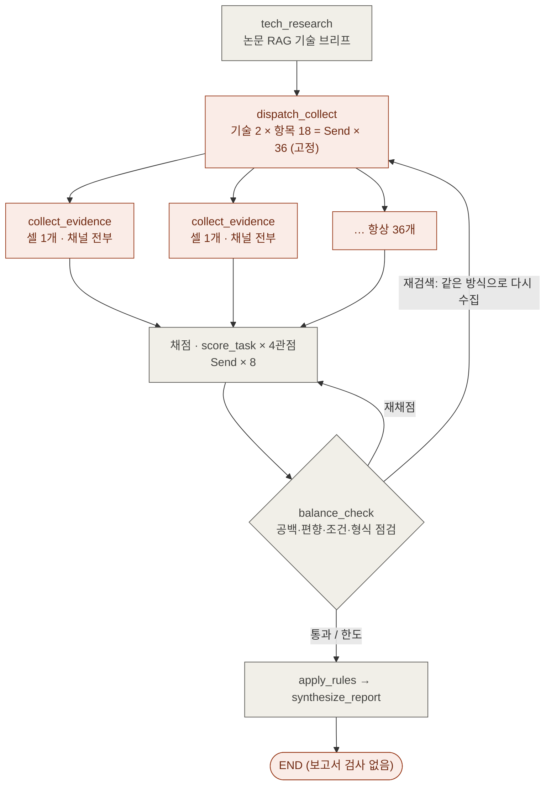
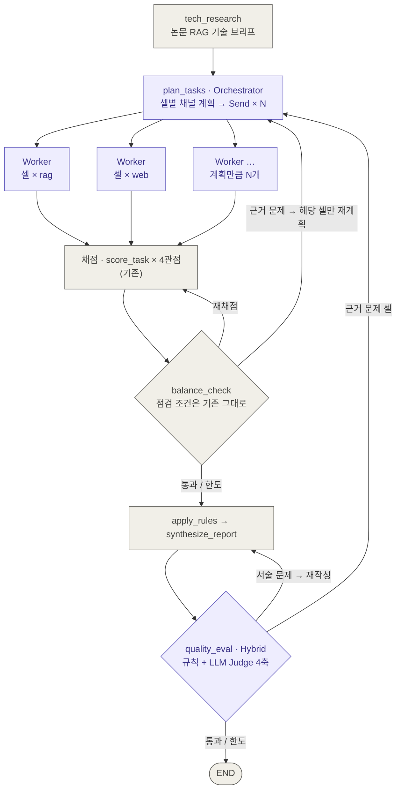
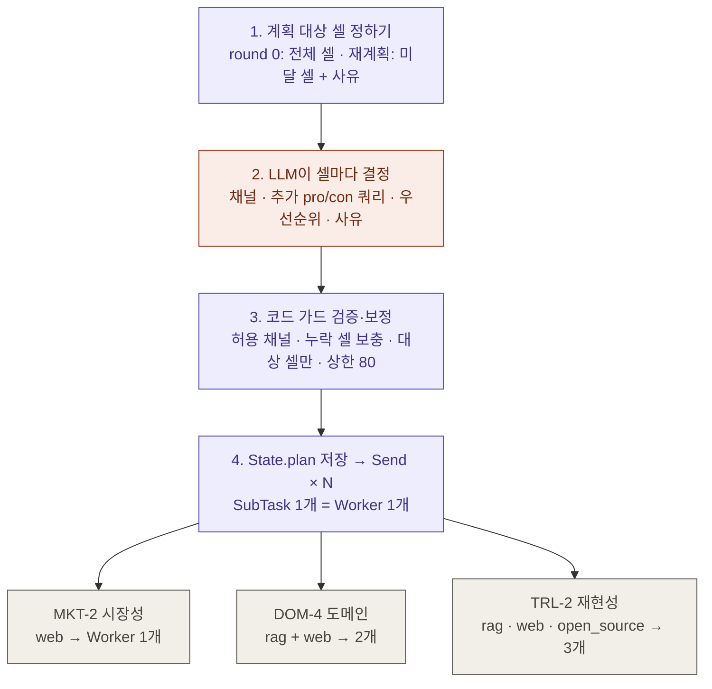
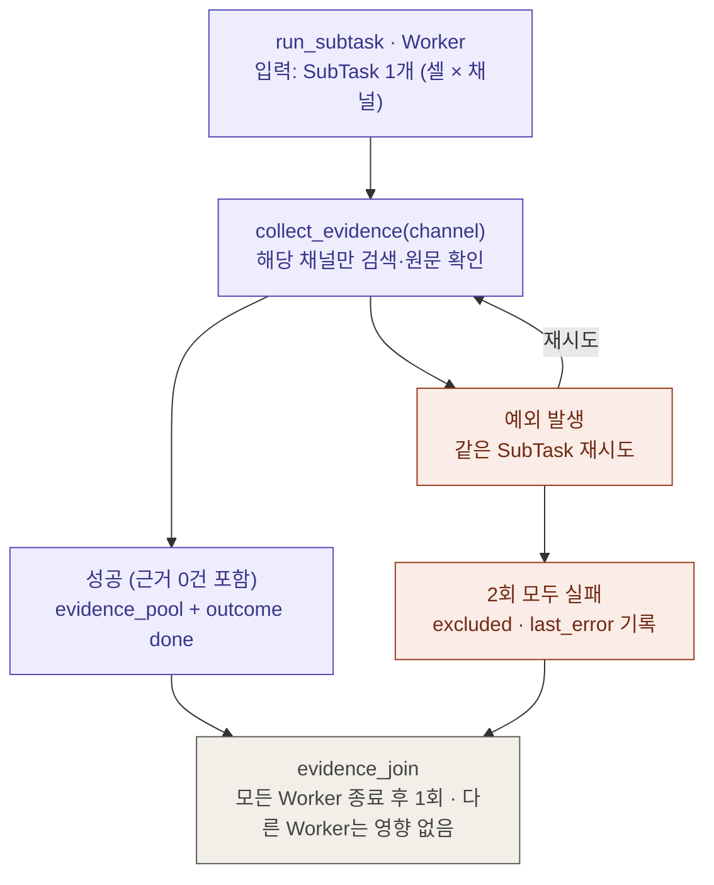
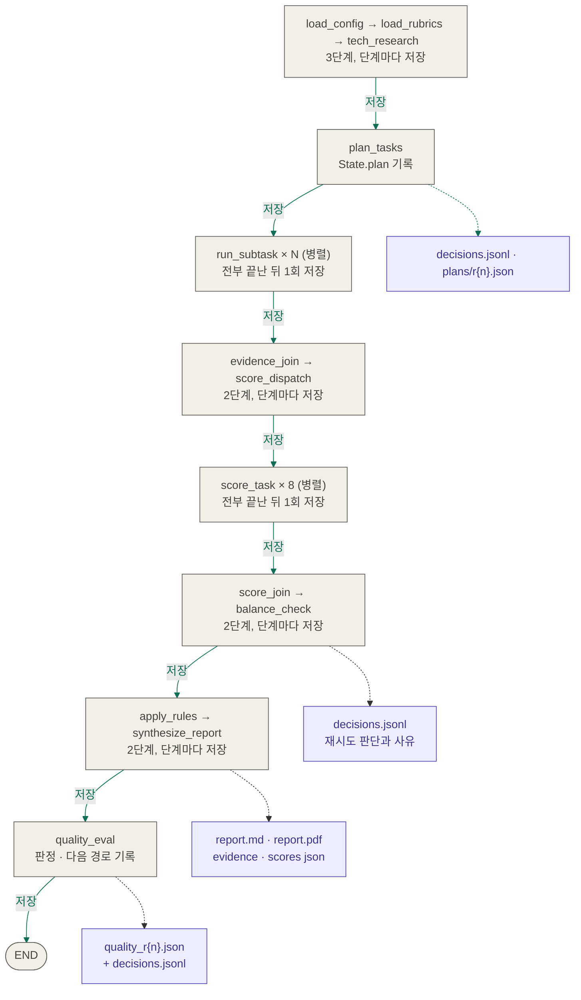

# 구조도 — `main`(RAG 과제) vs `agent/orchestrator-workers`(Agent 과제)

GitHub에서 Mermaid로 렌더링됩니다. 변경 내역 설명은 [`agent-orchestrator-changes.md`](agent-orchestrator-changes.md) 참고.

## 1. 원래 그래프 (`main`)

주황 = Agent 과제에서 교체된 부분, 회색 = 그대로 유지

## 2. 바뀐 그래프 (이 브랜치)

보라 = 새로 추가·교체, 회색 = 기존 로직 유지

## 3. Orchestrator(`plan_tasks`) 내부

주황 = LLM 판단, 보라 = 코드가 강제. 아래 예시의 채널 조합은 기본 계획(허용 채널 전부) 기준이며 실제 실행에서는 LLM이 범위 안에서 더 적게 고를 수 있음

## 4. Worker(`run_subtask`) 성공·실패 경로

## 5. State 저장 시점 (체크포인트)

저장은 노드가 아니라 LangGraph 실행기가 한다 — `app.py`가 `compile(checkpointer=SqliteSaver)`로 붙이면
**단계(superstep)가 끝날 때마다** State 전체를 `outputs/runs/checkpoints.sqlite`에 저장(`thread_id = run_id`).
병렬 구간은 Worker가 모두 끝나 reducer로 합쳐진 뒤 1회 저장. 보라색 파일은 노드가 직접 쓰는 관측용 파일로 재개에는 쓰지 않음.

> 화살표의 "저장" = SQLite 체크포인트(State 전체). 점선 = 노드가 직접 쓰는 파일.
