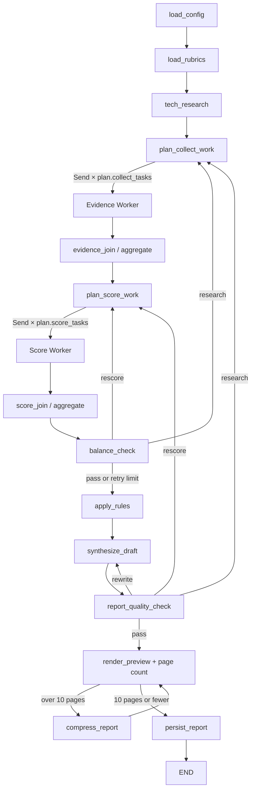

# Orchestrator-Workers 전환 계획

## 1. 목적과 설계 원칙

현재 프로젝트의 근거 수집·관점별 채점·종합 흐름을 유지하면서, 작업 목록을 State에 명시하는
Orchestrator-Workers 패턴으로 정리한다. 목표는 새로운 실행 프레임워크를 만드는 것이 아니라 기존
LangGraph의 `Send`, reducer, 조건부 라우팅을 더 명확한 계획 기반 흐름으로 연결하는 것이다.

참조 경로의 우선순위는 다음과 같다.

1. `/Users/ash/ashley/LangGraph-KV/langgraph-v1` — 현재 로컬에 없음
2. `/Users/ash/ashley/RAG-pipeline/langgraph-v1` — 현재 로컬에 있어 이 문서의 기준으로 사용

참조한 예제는 `12-Pattern/04-Orchestrator-Workers.ipynb`,
`01-Features/11-State-Customization.ipynb`, `01-Features/21-Branching.ipynb`이다. 예제에서 가져올 핵심은
작은 State, 구조화된 Plan, `Send` fan-out, reducer fan-in, 명시적인 Synthesizer다. 예제의 LLM
Planner는 가져오지 않고, 현재 프로젝트의 구조화된 기술·루브릭·재시도 대상을 사용하는 결정적 코드
Planner로 대체한다.

## 2. 현재 구조 진단

### 유지할 부분

- `MainState` 하나를 공유하고 `evidence_pool`, `search_log`, `criterion_results`를
  `operator.add` reducer로 병합하는 방식
- `CollectTask`와 `ScoreTask`를 작은 Worker 입력으로 사용하는 방식
- `Send`로 근거 수집과 관점별 채점을 병렬 실행하는 방식
- 모든 round의 근거를 누적하고, 기술·항목별 최신 채점만 선택하는 reducer 규칙
- `balance_check`가 근거 공백·편향·조건 누락·채점 오류를 코드로 판정하는 방식
- `RetryTarget(kind="research" | "rescore")`으로 필요한 항목만 다시 실행하는 방식
- `apply_rules`에서 점수 제한·TRL 게이트·상충 후보를 코드로 확정하는 방식
- 관점별 Agent와 `synthesis` Agent의 기존 프롬프트·구조화 출력 계약
- `KV_FAKE=1`을 이용한 전체 그래프 테스트 경로와 기존 CLI

### 보완할 부분

현재 최초 fan-out의 작업 수는 런타임 설정에 따라 계산되지만, `fan_out_collect`와
`fan_out_score`가 State에 계획을 남기지 않고 기술·루브릭의 곱을 즉석에서 다시 만든다.
`dispatch_collect`와 `score_dispatch`도 빈 dict만 반환하므로 Orchestrator의 계획 결과를 실행 전후에
검증할 수 없다. 재시도는 대상별로 동적이지만, 최초 실행과 재시도를 하나의 Plan 계약으로 설명하지
못한다.

또한 `evidence_join`과 `score_join`은 누적 건수만 출력한다. 정상적인 결과 0건과 Worker 실행 실패를
명확히 구분하지 못하며, 계획한 작업과 실제 완료된 작업의 대응도 확인하지 않는다. 보고서 단계는
LLM 종합, Markdown 조립, 파일 저장, PDF 렌더링을 한 함수에서 수행하고 바로 종료한다. 따라서 보고서
품질 검사와 실제 PDF 페이지 수에 따른 압축 루프를 삽입할 지점이 없다.

## 3. 목표 패턴과 Agent 역할

### Orchestrator / Planner

- `technologies`, `rubrics`, `only_criteria`, `retry_targets`, `retry_round`를 읽는다.
- 현재 phase에서 실행할 `CollectTask` 또는 `ScoreTask` 목록을 `WorkPlan`으로 만든다.
- 같은 State에는 항상 같은 순서와 내용의 Plan을 반환한다.
- 최초 작업 수나 Worker 종류를 상수로 하드코딩하지 않는다.
- LLM을 호출하지 않으며 Worker의 도메인 판단을 대신하지 않는다.

### Evidence Worker

- 기존 `collect_evidence(CollectTask)`를 유지한다.
- 하나의 기술·평가 항목에 대해서만 검색하고 `Evidence`와 검색 로그를 반환한다.
- 정상적인 근거 0건, 일부 처리 실패, 전체 실행 실패를 최소 `WorkerResult`로 구분한다.
- 다른 Worker나 Synthesizer를 직접 호출하지 않는다.

### Score Worker

- 기존 `score_task(ScoreTask)`와 네 관점 Agent를 유지한다.
- 기술·관점별 계획에 포함된 항목만 채점한다.
- 기존 즉시 1회 재요청과 NA fallback은 유지하되 최종 실행 실패 여부를 `WorkerResult`에 남긴다.
- 다른 Score Worker와 직접 통신하지 않는다.

### Aggregator

- 별도 범용 실행 계층이 아니라 기존 join 함수와 reducer helper의 책임을 확장한 역할이다.
- Plan의 작업과 같은 round의 `WorkerResult`를 비교한다.
- 성공 결과는 기존 reducer에 누적하고, retry 가능한 실패만 기존 `RetryTarget`으로 변환한다.
- 재시도 한도 소진 시 `info_gaps`에 남기고 성공한 결과는 보존한다.

### Synthesizer

- 기존 `agents/synthesis.py`를 재사용해 관점별 결과와 상충 후보를 종합한다.
- 최종 파일을 쓰지 않고 보고서 초안 문자열만 `report_draft`로 반환한다.
- Worker별 상세 로그 전체를 본문에 반복하지 않는다.

### Report Quality Evaluator

- 필수 섹션, 인용 ID, 정보 공백, 근거 없는 수치, 점수 합산·순위·단정적 우열 표현을 검사한다.
- 코드로 판정 가능한 항목은 규칙으로 검사한다.
- 문제를 기존 흐름으로 돌려보낼 `research`, `rescore`, `rewrite`, `compress` 중 하나로 분류한다.
- 보고서 재작성과 압축은 합쳐 최대 2회까지만 허용한다.

### Renderer

- 품질을 통과한 초안을 ReportLab으로 미리보기 PDF에 렌더링한다.
- `pypdf.PdfReader`로 실제 페이지 수를 계산한다.
- 10페이지 이하인 보고서만 기존 `report.md`와 `report.pdf` 이름으로 확정한다.

## 4. 최소 State 변경안

기존 `MainState` 필드는 삭제하거나 이름을 바꾸지 않는다. 다음 필드만 추가한다.

| 필드 | 형식 | 갱신 방식 | 용도 |
|---|---|---|---|
| `work_plan` | `WorkPlan` | phase마다 교체 | 현재 실행할 Worker 작업 목록 |
| `worker_results` | `Annotated[list[WorkerResult], operator.add]` | 병렬 누적 | Worker 성공·부분 성공·실패 메타데이터 |
| `report_draft` | `str` | 재작성 시 교체 | 저장 전 보고서 본문 |
| `report_quality` | `ReportQualityResult` | 검사마다 교체 | 품질 및 페이지 판정 |
| `report_retry_round` | `int` | 최대 2까지 증가 | 보고서 rewrite/compress 종료 보장 |
| `report_page_count` | `int` | 렌더링마다 교체 | 실제 PDF 페이지 수 |

기존 `retry_targets`, `retry_round`, `info_gaps`는 근거 수집·채점 재시도에 계속 사용한다. 작업별 상태
Registry나 별도 orchestration history는 추가하지 않는다. 현재 Plan과 누적 Worker 결과만으로 라우팅에
필요한 정보를 계산한다.

## 5. 최소 신규 모델

`task_schema.py`에는 다음 세 모델만 추가한다.

```python
class WorkPlan(BaseModel):
    collect_tasks: list[CollectTask] = Field(default_factory=list)
    score_tasks: list[ScoreTask] = Field(default_factory=list)
    round: int = 0
    reason: str = "initial"


class WorkerResult(BaseModel):
    task_id: str
    kind: Literal["collect", "score"]
    status: Literal["completed", "partial", "failed"]
    produced_count: int = 0
    retryable: bool = False
    error: str | None = None


class ReportQualityResult(BaseModel):
    passed: bool
    page_count: int | None = None
    issues: list[str] = Field(default_factory=list)
    retry_kind: Literal["research", "rescore", "rewrite", "compress"] | None = None
```

`task_id`는 별도 UUID 저장소 없이 작업 내용에서 결정적으로 만든다. 예를 들어 수집은
`collect:{round}:{tech_id}:{criterion_id}`, 채점은
`score:{round}:{tech_id}:{agent_type}:{criterion_ids}` 형태를 사용한다. 상태 enum, 이벤트 모델,
dependency graph 모델은 현재 두 단계 fan-out에는 필요하지 않으므로 만들지 않는다.

## 6. 상태 전이

### 정상 흐름

1. 설정·루브릭·기술 개요를 읽는다.
2. `plan_collect_work`가 State에 수집 Plan을 저장한다.
3. Plan의 `collect_tasks`를 `Send`로 Evidence Worker에 fan-out한다.
4. reducer와 `evidence_join`이 결과를 모은다.
5. `plan_score_work`가 누적 근거를 포함한 채점 Plan을 저장한다.
6. Plan의 `score_tasks`를 `Send`로 Score Worker에 fan-out한다.
7. reducer와 `score_join`이 결과를 모은다.
8. `balance_check`를 통과하면 규칙을 적용하고 보고서 초안을 만든다.
9. 품질 검사와 PDF 페이지 검사를 통과하면 최종 파일을 저장한다.

### Worker 실패

1. Worker 내부에서 예상 가능한 외부 호출·파싱 오류를 잡고 `WorkerResult(status="failed")`를 반환한다.
2. join은 같은 round의 실패 결과를 확인한다.
3. retry 가능하고 기존 `retry_round` 한도가 남았으면 해당 셀만 `RetryTarget`으로 만든다.
4. 한도를 소진하면 `info_gaps`에 기록하고 성공한 다른 Worker 결과를 유지한다.
5. 프로그래밍 오류처럼 예상하지 않은 예외까지 모두 숨기지는 않는다.

참조 Branching 예제에서 병렬 superstep 중 처리되지 않은 예외 하나가 전체 상태 갱신을 취소할 수 있으므로,
외부 검색과 구조화 출력처럼 예상 가능한 실패만 Worker 경계에서 결과로 변환한다.

### 근거·채점 재시도

- `balance_check`가 `research` 문제를 만들면 `plan_collect_work`로 돌아간다.
- 형식 오류만 있으면 `plan_score_work`로 돌아가 근거 수집을 건너뛴다.
- 기존 round 누적과 최신 채점 선택 규칙을 그대로 사용한다.
- 최대 round를 소진하면 문제를 `info_gaps`에 남기고 규칙 적용으로 진행한다.

### 보고서 품질과 압축

1. 초안 품질 문제가 근거나 채점에서 비롯되면 각각 수집 또는 채점 Plan으로 돌아간다.
2. 서술·구조 문제면 Synthesizer만 다시 실행한다.
3. 품질을 통과하면 미리보기 PDF를 렌더링하고 실제 페이지 수를 센다.
4. 10페이지를 초과하면 `compress_report`로 보내 중복과 상세 서술을 줄인 뒤 다시 렌더링한다.
5. `report_retry_round == 2`인데도 품질 미달 또는 10페이지 초과면 최종 성공으로 저장하지 않고 명시적으로
   실패한다. 초과 PDF를 정상 결과처럼 남기지 않는다.

## 7. 최종 목표 그래프



`plan_*` 노드는 참조 예제의 Orchestrator, `fan_out_*` 함수는 `assign_workers`, 기존 수집·채점 노드는
Worker, reducer와 join은 fan-in, `synthesize_draft`는 Synthesizer에 대응한다. 품질과 페이지 검사는
보고서 과제의 종료 조건을 위해 Synthesizer 뒤에만 추가한다.

## 8. 10페이지 PDF 제한 방식

페이지 제한은 글자 수 추정이 아니라 실제 렌더링 결과로 검증한다.

1. `synthesize_draft`는 저장하지 않은 Markdown 문자열을 만든다.
2. 규칙 기반 품질 검사를 먼저 수행한다.
3. 임시 preview PDF를 기존 ReportLab renderer로 만든다.
4. 이미 설치된 `pypdf`로 페이지 수를 센다.
5. 10페이지 초과 시 다음 순서로 내용을 축약한다.
   - 중복 설명 제거
   - 항목별 rationale을 핵심 한 문장으로 제한
   - 반복되는 방법론을 한 표로 통합
   - 상세 검색 로그·루브릭·채점 내역은 기존 JSON 산출물에만 유지
   - 실제 인용한 출처만 Reference에 유지
6. 핵심 결과, 근거 ID, 실험 조건 차이, 상충 지점, 정보 공백, 한계는 삭제하지 않는다.
7. 본문 글자 크기는 9pt 미만으로 줄이지 않으며 여백 축소보다 내용 축약을 우선한다.
8. 8~10페이지를 권장 범위로 하고 10페이지 이하만 최종 저장한다.

권장 페이지 예산은 제목·요약 1, 범위·방법 1, 기술별 평가 각 2, 비교·트레이드오프 1.5,
시나리오·이해관계자 1, 한계·정보 공백 0.5, Reference 1페이지다. 상세 자료는
`evidence.json`, `scores.json`, `search_log.json`, `info_gaps.json`에 보존한다.

## 9. 단계별 변경 파일

| 단계 | 변경 또는 추가 파일 | 책임 |
|---|---|---|
| 계약 | `src/kv_eval/graph/task_schema.py`, `src/kv_eval/graph/state.py` | 세 모델과 최소 State 필드 |
| 계획 | 신규 `src/kv_eval/graph/planner.py`, `src/kv_eval/graph/dispatch.py` | 코드 Plan과 `Send` |
| Worker·집계 | `src/kv_eval/evidence/collect.py`, `src/kv_eval/agents/score_task.py`, `src/kv_eval/graph/reducers.py`, `src/kv_eval/graph/dispatch.py` | 실패 구분과 join 검증 |
| 보고서 | `src/kv_eval/agents/synthesis.py`, `src/kv_eval/reporting/report.py`, `src/kv_eval/reporting/pdf.py`, 신규 `src/kv_eval/rules/report_quality.py` | 초안·품질·페이지·저장 분리 |
| 통합 | `src/kv_eval/graph/main.py`, `src/kv_eval/rules/balance.py`, `configs/runtime.yaml`, `app.py` | 라우팅과 유한 반복 |
| 검증 | `tests/`, `README.md`, `docs/architecture.md`, `docs/main_graph.mmd` | 회귀·실패·페이지 테스트와 문서 |

공유 파일인 `task_schema.py`와 `state.py`의 기존 필드는 삭제하지 않는다. `main.py` 연결은 각 구성 요소의
단위 테스트가 준비된 뒤 마지막 통합 단계에서 변경한다.

## 10. 만들지 않을 추상화

- 범용 Worker Runtime 또는 자체 스케줄러
- 이벤트 버스, 메시지 브로커, Repository 계층
- Agent·Worker Registry나 플러그인 프레임워크
- 계층형 Manager/Supervisor와 Agent 간 직접 handoff
- 범용 DAG·dependency 엔진 또는 별도 Task 데이터베이스
- 현재 두 fan-out 단계에 필요하지 않은 상태 enum과 이벤트 이력 모델
- LLM Planner와 계획 재평가 Agent
- 기존 `RetryTarget`과 중복되는 새 재시도 계약
- 기존 `Evidence`, `CriterionResult`를 감싸는 중복 결과 객체
- 페이지 수만 줄이기 위한 별도 문서 서비스나 외부 PDF 도구

이 전환은 기존 그래프를 재작성하지 않는다. 계획을 State에 드러내고, Worker 실패를 최소 메타데이터로
구분하며, Synthesizer 뒤에 품질·페이지 종료 조건을 추가하는 범위로 제한한다.
